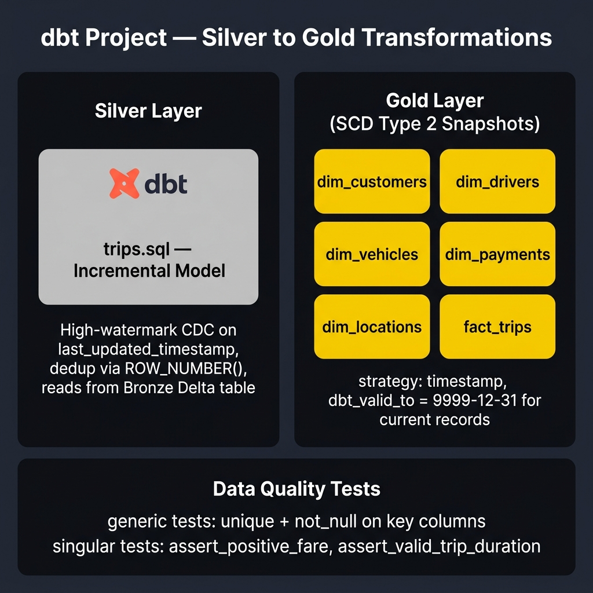

# dbt Project — Silver to Gold Transformations

This sub-project contains the **dbt** data transformation models that power the **Gold layer** of the Medallion Architecture. It reads from the Silver Delta tables (produced by PySpark) and builds business-ready, aggregated analytical tables.



---

## Project Details

| Property | Value |
|---|---|
| **dbt Project Name** | `pyspark_dbt_airflow_internal` |
| **Version** | 1.0.0 |
| **Profile** | `default` |
| **Target Platform** | Databricks (Delta Lake) |

---

## Directory Structure

```
dbt_project/
├── models/
│   ├── source/
│   │   └── sources.yml          # Bronze + Silver source definitions
│   └── silver/
│       └── trips.sql            # Incremental model with CDC watermark (reads from Bronze)
├── snapshots/
│   └── scds.yml                 # SCD Type 2 snapshots → Gold layer (5 dims + fact_trips)
├── analyses/      # Ad-hoc analytical SQL (not materialised)
├── macros/        # Reusable Jinja SQL macros
├── seeds/         # Static CSV seed data
├── tests/         # Custom data quality tests
├── dbt_project.yml  # Project configuration
└── .gitignore
```

---

## What's Implemented

### Silver Layer — `models/silver/trips.sql`
The `trips` entity is handled by dbt as an **incremental model** (other Silver entities are handled by PySpark).

- Reads from `pyspark_dbt.bronze.trips`
- Uses a **CDC high-watermark** pattern: only loads rows where `last_updated_timestamp` is newer than the current max in the table
- Materialised as a Delta table in `pyspark_dbt.silver`

```sql

where last_updated_timestamp > (select coalesce(max(last_updated_timestamp),'1990-01-01') from {{ this }})

```

---

### Gold Layer — `snapshots/scds.yml` (SCD Type 2)
The entire Gold layer is built using **dbt snapshots** — not regular models. This implements **Slowly Changing Dimensions Type 2**, preserving the full history of each record with `dbt_valid_from` / `dbt_valid_to` columns.

| Snapshot | Source | Key | Schema |
|---|---|---|---|
| `dim_customers` | `source_silver.customers` | `customer_id` | `pyspark_dbt.gold` |
| `dim_drivers` | `source_silver.drivers` | `driver_id` | `pyspark_dbt.gold` |
| `dim_vehicles` | `source_silver.vehicles` | `vehicle_id` | `pyspark_dbt.gold` |
| `dim_payments` | `source_silver.payments` | `payment_id` | `pyspark_dbt.gold` |
| `dim_locations` | `source_silver.locations` | `location_id` | `pyspark_dbt.gold` |
| `fact_trips` | `ref('trips')` (Silver dbt model) | `trip_id` | `pyspark_dbt.gold` |

All snapshots use the `timestamp` strategy on `last_updated_timestamp`, with open-ended records set to `9999-12-31`.

---

## Data Flow

```
pyspark_dbt.bronze.trips          (produced by PySpark Bronze notebook)
        │
        ▼
   dbt incremental model          (models/silver/trips.sql — CDC watermark)
        │
        ▼
pyspark_dbt.silver.trips
        │
        ▼
   dbt SCD Type 2 snapshot        (snapshots/scds.yml — fact_trips)
        │
        ▼
pyspark_dbt.gold.fact_trips

pyspark_dbt.silver.*              (customers, drivers, vehicles, payments, locations)
   produced by PySpark notebooks  ↓
   dbt SCD Type 2 snapshots       (snapshots/scds.yml — dim_*)
        │
        ▼
pyspark_dbt.gold.dim_*
```

---

## Common Commands

```bash
# Run the Silver incremental model
dbt run --select silver.trips

# Run all SCD Type 2 snapshots (Gold layer)
dbt snapshot

# Run everything
dbt run && dbt snapshot

# Test data quality
dbt test

# Generate and serve documentation
dbt docs generate
dbt docs serve

# Clean compiled artifacts
dbt clean
```

---

## Prerequisites

1. **dbt-databricks** adapter installed:
   ```bash
   pip install dbt-databricks
   ```

2. **`profiles.yml`** configured (typically at `~/.dbt/profiles.yml`):
   ```yaml
   default:
     target: dev
     outputs:
       dev:
         type: databricks
         host: <your-workspace>.azuredatabricks.net
         http_path: /sql/1.0/warehouses/<warehouse-id>
         token: <your-pat-token>
         catalog: pyspark_dbt
         schema: gold
   ```

---

## Integration with Airflow

The `dbt_gold_layer_execution` DAG in `airflow_project/` automatically triggers this dbt project as part of the master medallion pipeline, after the PySpark Silver Transformation completes.